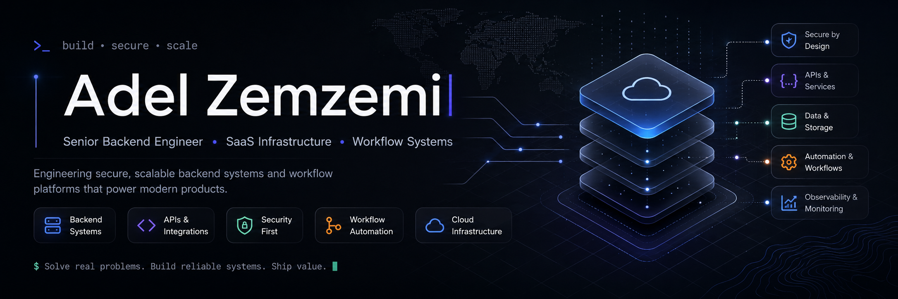

  

# Adel Zemzemi

Senior backend engineer building modern SaaS infrastructure, APIs, workflow systems, and scalable backend architecture. Founder of [Vimatech LTD](https://vimatech.io).

Paris, France · Working with clients across the UK, Europe and the US.

## What I work on

**Client work**
Long-term engagements with startups and scale-ups — backend architecture, API design, SaaS platforms, and technical ownership of complex systems.

### Open Source

Building infrastructure packages for the Laravel and TypeScript ecosystems.

- [Laravel Membership](https://github.com/vimatech-io/laravel-membership) — Polymorphic memberships for Laravel
- [Laravel Invitations](https://github.com/vimatech-io/laravel-invitations) — Generic email-based invitation system for Laravel
- [Laravel Secure Fields](https://github.com/vimatech-io/laravel-secure-fields) — Modern encrypted Eloquent fields for Laravel
- [Laravel Document Numbering](https://github.com/vimatech-io/laravel-document-numbering) — Sequential, gap-free, concurrency-safe document numbering (invoices, quotes, credit notes)
- [Laravel Integrations](https://github.com/vimatech-io/laravel-integrations) — Config-driven ports & adapters foundation for external providers
- [Laravel E-Invoicing](https://github.com/vimatech-io/laravel-einvoicing) — Native Peppol BIS 3.0 / EN 16931 e-invoice generation & dispatch
- Laravel Bookable — Minimal booking infrastructure for Laravel *(coming soon)*
- [CryptoBox](https://github.com/adelzemzemi/CryptoBox) — Zero-dependency encryption library for JS/TS · [npm](https://www.npmjs.com/package/@azemzemi/cryptobox)

### Products
- [MakeResume](https://makeresume.io) — SaaS resume builder · Live
- Rendevo — Intelligent scheduling platform *(in development)*

## Stack
`PHP` `Laravel` `FrankenPHP` `Vue.js` `Nuxt` `TypeScript` `PostgreSQL` `Redis` `Docker` `AWS` `Cloudflare` `n8n` `REST APIs` `CI/CD`

## Connect

- Email: [hello@adelzemzemi.dev](mailto:hello@adelzemzemi.dev)
- Website: [adelzemzemi.dev](https://adelzemzemi.dev)
- LinkedIn: [linkedin.com/in/adel-zemzemi](https://linkedin.com/in/adel-zemzemi)
- Vimatech: [vimatech.io](https://vimatech.io)
