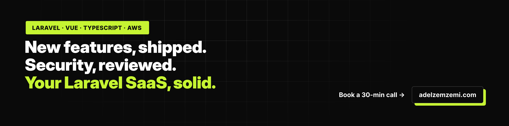

  

# Adel Zemzemi

I build SaaS, scale it, and run it in production. Laravel SaaS architect and engineer: Laravel, PHP, Vue, Nuxt, TypeScript, AWS. Founder of [Vimatech Ltd](https://vimatech.io), where I build and run my own products.

Near Paris, France · Remote, written-first.

## What I do for your Laravel SaaS

- **New features shipped, or the audit findings fixed.** Implementation Sprints of 5 or 10 days: scoped in writing, merged, documented.
- **Security and code, audited.** The [Laravel Code Audit](https://adelzemzemi.com/laravel-code-audit/): every risk ranked by severity with its fix, a 30/60/90-day plan, a 60-minute debrief. 5 business days.
- **A senior Laravel lead, every month.** Code reviews, architecture decisions and features, on a Fractional Laravel Lead plan.

**[Book a 30-minute call →](https://adelzemzemi.com)**

## Open source

Laravel packages extracted from my own products, published on Packagist under [vimatech-io](https://github.com/vimatech-io).

- [Laravel Membership](https://github.com/vimatech-io/laravel-membership) · polymorphic memberships: who belongs to what, and with which role
- [Laravel Invitations](https://github.com/vimatech-io/laravel-invitations) · email invitations to any Eloquent model
- [Laravel Secure Fields](https://github.com/vimatech-io/laravel-secure-fields) · encrypted Eloquent fields, searchable blind indexes, key rotation
- [Laravel Quotas](https://github.com/vimatech-io/laravel-quotas) · feature entitlements and usage quotas for SaaS plans
- [Laravel Document Numbering](https://github.com/vimatech-io/laravel-document-numbering) · sequential, gap-free, concurrency-safe document numbers
- [Laravel E-Invoicing](https://github.com/vimatech-io/laravel-einvoicing) · Peppol BIS 3.0 / EN 16931 e-invoice generation and dispatch
- [Laravel Integrations](https://github.com/vimatech-io/laravel-integrations) · ports and adapters for external providers, normalized webhooks
- [Laravel Audit Log](https://github.com/vimatech-io/laravel-audit-log) · append-only, tenant-aware audit log
- [CryptoBox](https://github.com/adelzemzemi/CryptoBox) · zero-dependency AES-256-GCM encryption for JavaScript and TypeScript · [npm](https://www.npmjs.com/package/@azemzemi/cryptobox)

## Products

- [MakeResume](https://makeresume.io) · SaaS resume builder, live. Laravel, Vue, Inertia, Paddle, AWS. Designed, built and run alone.
- [Rendevo](https://rendevo.com) · Booking SaaS that qualifies leads first: prospects answer your questions, and only those who match your rules can book. Live. Laravel API, Nuxt, Astro, Paddle, Google and Outlook calendars. Designed, built and run alone.

## Stack

`Laravel` `PHP` `Vue` `Nuxt` `TypeScript` `AWS` `FrankenPHP` `PostgreSQL` `Redis` `Docker` `Cloudflare` `CI/CD` · `Symfony`

## Contact

[adelzemzemi.com](https://adelzemzemi.com) · [LinkedIn](https://www.linkedin.com/in/adel-zemzemi/) · [hello@adelzemzemi.com](mailto:hello@adelzemzemi.com)
